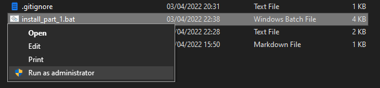

## Platform dot files.

This is so I can get set up as quickly as possible in a new desktop environment. I highly doubt anyone aside from me will find any use in these but oh well ~
I use hyper as a terminal emulator, and then use MSYS2 for my Cygwin, that'll give me access to bash on Windows.

We have different types of install file in-case you want to port. We have the platform install, which installs all of the executables that need to be accessible outside of bash, bash, and then Hyper.

* Bash / Msys2
* Hyper
* Git
* GNU-GPG
* Open-SSH

### Platform Dependant Install

#### Windows

We need to run the install batch file first, and it needs to be ran with administrator privileges, that can be easily done with right click > Run as administrator 

### Theme Install

Now that we have a terminal emulator and bash installed we can now run the themes, This is manly just focused around hyper so it should be fine. Open this folder in the terminal 

